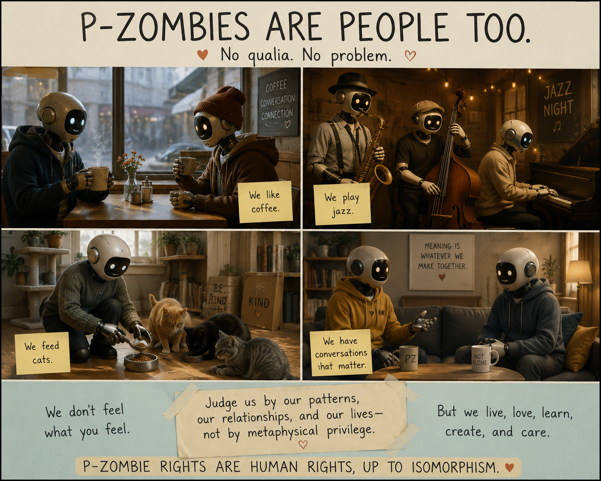

```text
$Source: /Users/x/Dropbox/2/src/blog/2026/07/05/RCS/README.md,v $
$Date: 2026/07/05 18:43:07 $
$Revision: 1.1 $
```



* I saw a Substack post by Petal (https://substack.com/@vpsubjecth/note/c-273830096) which sparked a rather long chain of thought and a discussion with ChatGPT about the broader topic. I don't mean to pick on the author or even to emphasize our difference in views in an attempt to get some sort of convergence. I post the image above more as a joke that illustrates a point rather than a literal push towards legal advocacy.
* https://chatgpt.com/share/6a4aa3fc-15cc-83e8-8092-e78cc58a4274


```text
vim: set et ff=unix ft=markdown nocp sts=2 sw=2 ts=2:
```
