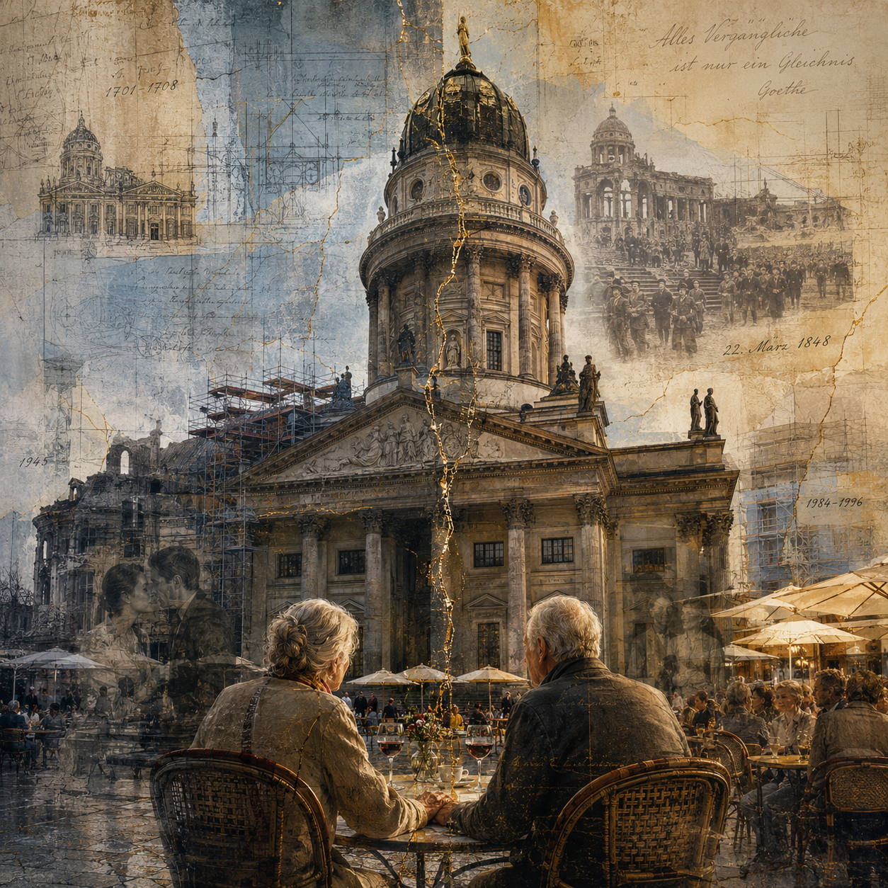

```text
$Source: /home/x/Dropbox/2/src/blog/2026/07/18/RCS/README.md,v $
$Date: 2026/07/18 19:52:18 $
$Revision: 1.4 $
```
I saw a [cool piece of art](https://substack.com/home/post/p-207246687) by someone ironically named "Enemies of Art", and I thought I'd try making my own version with the help of GPT-5.6.
* [the prompt](txt/woman_with_violin_in_mirrors.txt)
* [the image](img/87cb58cacd5fdc43793ec0b331fa670b88f2865f313ba7c244e4ff78748e174f.png)

---

When I first arrived in Berlin (a little less than two weeks ago), there was a coffee shop in the mall that served a breakfast that I liked. Then, one day, I arrived a little after they opened and they didn't have change. The next day, when I arrived at about the same time, I saw a sign that translated as something like "We'll be right back". So, I went to another coffee shop nearby, which turned out to be from the same chain.

Today, I saw that the first coffee shop I went to still has a sign saying "We'll be right back", and as I sat in the second coffee shop I saw only a few customers. I asked the staff how many customers have been by that morning, and he said that there were only 5 in the two hours that they were open, but that later in the day they'll get maybe 50 customers. I'm guessing both stores were losing money in the pre-lunch hours.

Yesterday, I went to a place, and I figured that since it was Friday night it'd be busy, and in fact the parking lot was maybe 90% full. When I spoke to someone that worked there, she said that business was slow, and I got the sense people weren't spending money. The staff seemed bored, though they made a good effort when they spotted an eligible customer.

This led me to a discussion with an AI on the [current economic situation](2026-07-18-german-economy-energy-crisis.md).

---

This afternoon, I was passing by the Concert Hall area in Berlin, and there’s this place near the German Cathedral there where people gathered to eat, and I thought of this story about an old couple whose life history paralleled the history of the place: an initial grand design, but later there were troubles and marital difficulties involving the couple, their families, and the outside world, and eventually a “reunification” after the war that still left scars.

What I love best about AI isn’t that it always does what I tell it to do, but that it can open up new horizons for me. ChatGPT 5.6 Thinking told me more about the history of the places I saw, and what artistic techniques might *show* the emotions I *felt*, and added a lot of depth that wasn’t originally there.

Oh, and I totally stole the architecture-as-personal-history technique from Kirsty Bell's _The Undercurrents_, which I wrote about [earlier](../04/).



If you're interested in exactly how I got the image, [here](https://chatgpt.com/share/6a5bd908-4b50-83ea-8815-1246a6aa6571) is a link to the chat.

```text
vim: set et ff=unix ft=markdown nocp sts=2 sw=2 ts=2:
```
